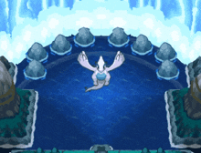

# Pokémon Desktop Pet - Lugia

  

A lightweight Electron-based desktop pet featuring Lugia with smooth animations and random behaviors.

## 🛠 Tech Stack




## ✨ Features

- **Multi-sprite animation system**:
  - 2 walking sprites (walking1.gif, walking2.gif)
  - 1 idle sprite (idle.gif)
- **Behavior patterns**:
  - Random movement within bounds
  - Direction reversal at screen edges
  - Randomized idle states
- **Electron integration**:
  - Frameless transparent window
  - System tray control
  - Cross-platform compatibility

## ⚙️ Technical Implementation

### Animation System (index.js)

- **Sprite cycling**: Alternates between walking sprites every 20 frames
- **Movement logic**:
  - Linear horizontal movement with direction reversal
  - 500ms pause at screen edges
- **Random idle behavior**:
  - Triggers after 50-300 movements (configurable)
  - Lasts 1-3 seconds (configurable)

### Electron Configuration (main.js)

- **Window settings**:
  - 250x150px frameless window
  - Transparent background
  - Disabled context isolation for DOM access
- **Tray system**:
  - 16x16px tray icon
  - Click to toggle visibility
  - Right-click menu for exit

### Performance Considerations

- Uses `will-change: transform` for smooth animations
- Image-rendering set to `pixelated` for crisp sprites
- Efficient requestAnimationFrame-based animation

## 📝 Customization Options

```javascript
// In index.js
const CONFIG = {
  movementSpeed: 1, // Pixels per frame
  animationInterval: 50, // ms between frames
  edgePauseDuration: 500, // ms at screen edges
  minMovesBeforeIdle: 50, // Minimum movements before idle
  maxMovesBeforeIdle: 300, // Maximum movements before idle
  minIdleDuration: 1000, // Minimum idle time (ms)
  maxIdleDuration: 3000, // Maximum idle time (ms)
};
```

## 📌 Requirements

- Node.js v14+
- Electron v15+
- Windows/macOS/Linux

## 📜 License

MIT License - Free for personal and commercial use
